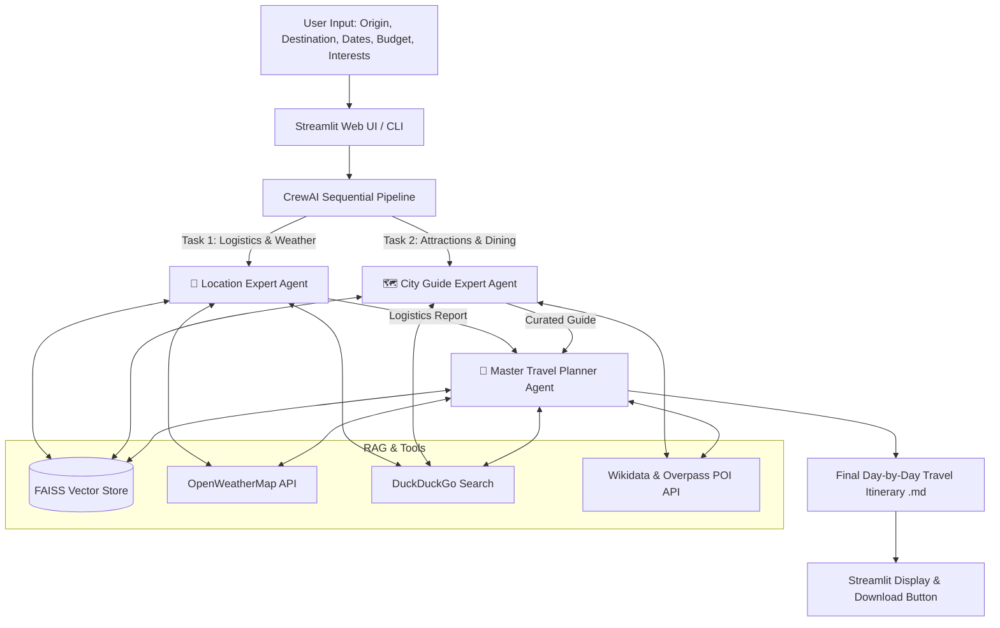

# 🧭 Agentic AI Travel Planner

[](https://www.python.org/)
[](https://github.com/crewAIInc/crewAI)
[](https://streamlit.io/)
[](https://groq.com/)
[](https://github.com/facebookresearch/faiss)

An intelligent, multi-agent travel planning assistant powered by **CrewAI**, **Groq (Llama 3.3 70B)**, and **Streamlit**. It generates hyper-personalized, day-by-day travel itineraries with real-time weather forecasts, curated tourist landmarks, dining recommendations, and budget management.

---

## 🌟 Key Features

- 🧠 **Collaborative Multi-Agent Architecture**: Uses specialized autonomous agents (Location Expert, City Guide, Master Planner) coordinating sequentially via CrewAI.
- ⚡ **Ultra-Fast & Cost-Free LLM**: Integrated with **Groq's Llama 3.3 70B Versatile** engine for high-intelligence reasoning with near-zero latency.
- 🔍 **Hybrid Intelligence (RAG + Live Web)**:
  - **Local RAG**: Queries an offline **FAISS vector database** indexed with `sentence-transformers/all-MiniLM-L6-v2` for destination insights and safety advice.
  - **Live Weather**: Fetches real-time temperature and conditions via **OpenWeatherMap API**.
  - **POIs & Attractions**: Queries **Wikidata SPARQL** and **OpenStreetMap Overpass API** for real points of interest.
  - **Web Intelligence**: Uses **DuckDuckGo Search** for up-to-date travel logistics and advisories.
- 🎨 **Modern Streamlit Dashboard**: Clean, responsive dark-mode UI with dynamic form inputs and one-click markdown itinerary downloads.

---

## 🏛️ System Architecture



---

## 👥 The Agent Team

| Agent | Role | Capabilities |
| :--- | :--- | :--- |
| **📍 Travel Logistics Expert** | Logistics & Readiness | Researches accommodations, daily cost estimates based on budget, transport options, visa advisories, and weather forecasts. |
| **🗺️ City Guide Expert** | Local Experience & Culture | Discovers top sights, hidden gems, culinary hotspots, outdoor adventures, and local events matched to personal interests. |
| **📅 Travel Planner** | Master Synthesis | Combines logistics and guide insights into an engaging, chronological day-by-day itinerary with exact cost breakdowns and links. |

---

## 📁 Repository Structure

```text
├── data/
│   ├── faiss_index/             # Pre-built FAISS vector database (index.faiss, index.pkl)
│   └── rag_docs/                # Source markdown files for offline RAG retrieval
├── Bangkok/                     # Sample generated itinerary output
├── Milan/                       # Sample generated itinerary output
├── Paris/                       # Sample generated itinerary output
├── Rome/                        # Sample generated itinerary output
├── Tokyo/                       # Sample generated itinerary output
├── .env.example                 # Environment variables template
├── .gitignore                   # Git exclusion rules (protects API keys and venv)
├── build_vector_store.py        # Script to vectorize rag_docs into FAISS index
├── sample_db_creation.py        # Generates initial knowledge base documents
├── planner_app.py               # Streamlit web application runner
├── travel_agent_task.py         # Multi-agent definitions, tasks, and CLI runner
├── travel_plan_utils.py         # External tools (RAG, Weather, Overpass, Search)
├── requirements.txt             # Project dependencies
└── README.md                    # Project documentation
```

---

## 🚀 Getting Started

### 1. Prerequisites
- **Python 3.10** (Recommended for FAISS and PyTorch compatibility on Windows/Linux/macOS)
- Free API keys from:
  - [Groq Cloud Console](https://console.groq.com/keys) (for LLM inference)
  - [OpenWeatherMap](https://openweathermap.org/api) (for live weather updates)

### 2. Clone the Repository
```bash
git clone https://github.com/<your-username>/<your-repo-name>.git
cd <your-repo-name>
```

### 3. Set Up a Virtual Environment
```bash
# Windows
py -3.10 -m venv venv
.\venv\Scripts\Activate.ps1

# macOS / Linux
python3.10 -m venv venv
source venv/bin/activate
```

### 4. Install Dependencies
```bash
pip install --upgrade pip
pip install -r requirements.txt
```

### 5. Configure Environment Variables
Create a `.env` file in the root directory (you can copy `.env.example`):
```bash
cp .env.example .env
```

Add your API keys inside `.env`:
```ini
GROQ_API_KEY=gsk_your_groq_api_key_here
OPENWEATHERMAP_API_KEY=your_openweathermap_api_key_here
```

---

## 💻 Running the Application

### Option A: Interactive Streamlit Web App (Recommended)
Launch the web interface:
```bash
streamlit run planner_app.py
```
Open your browser at `http://localhost:8501`, fill in your travel details (from city, destination, travel dates, interests, and budget), and click **"Generate Travel Plan"**.

### Option B: Command-Line (CLI)
Run the agent pipeline directly from terminal:
```bash
python travel_agent_task.py
```
This executes the workflow in verbose mode and exports markdown reports (`<City>_report.md`, `<City>_guide_report.md`, `<City>_travel_plan.md`) directly to disk.

---

## 🔄 Rebuilding the RAG Vector Store (Optional)

If you modify or add new markdown documents in `data/rag_docs/`, re-index them into FAISS with:

```bash
# 1. (Optional) Generate or refresh sample markdown files
python sample_db_creation.py

# 2. Re-create FAISS embeddings
python build_vector_store.py
```

---

## 🛡️ License

Distributed under the MIT License. Feel free to use, modify, and distribute for your own projects.
